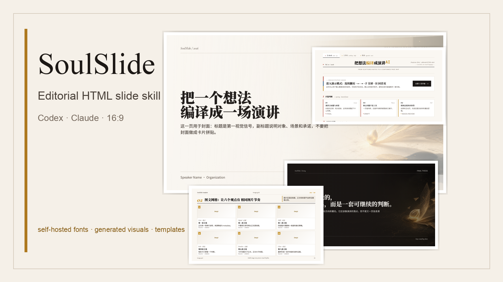
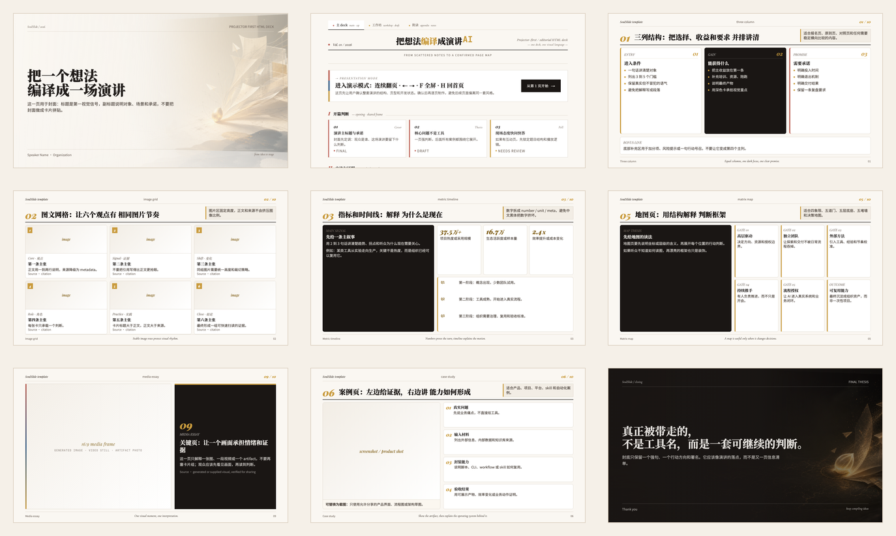

# soulslide

[English](README.md) | [简体中文](README.zh-CN.md)



SoulSlide 是一个面向 Codex 和 Claude 的 agent skill，用于生成具有一致视觉语言的 HTML 演示页：16:9 投影优先、暖纸质感、强中文字体层级、克制卡片，以及可复用的页面模板。

## 当前亮点

- 先采访再制作：agent 默认先追问观众、目标、材料、素材、限制和页数，再开始写 HTML。
- 导航/目录页：deck 先生成可复用的状态与播放壳，保留首页、上一页、下一页、全屏控制。
- 封面和封底：模板已加入生成视觉资产，并沉淀关键舞台页的轻呼吸、微浮动动效规则。
- 本地字体：模板从仓库内置 WOFF2 fallback 加载字体，不再依赖 Google Fonts。
- 最新样张：README 图片和 skill 内的 golden 截图都从当前 HTML/CSS 模板重新生成。

## 用途

当你希望 AI coding agent 做这些事时，可以使用 SoulSlide：

- 创建新的 HTML 单页 slide 或 deck 章节
- 把粗糙内容重排成可直接投影的演示页
- 在写 CSS 之前先选择合适的布局模板
- 保持标题、正文、引用、来源和元信息的字体层级一致
- 在模板需要真实视觉资产时，生成或请求合适的图片
- 用明确的美术方向和轻动效规则提升封面、封底和关键视觉页
- 通过仓库内置 WOFF2 字体 fallback 保持离线和跨机器渲染一致，不依赖远程字体链接
- 校验字号、图片节奏、翻页笔交互和 16:9 截图质量

SoulSlide 不是通用 PPT 主题，而是一套紧凑的 HTML slide 生产语法。它的目标是让不同页面看起来属于同一个 deck 家族。

## 最佳提示词

想把这个 skill 用好，最好先让 agent 规划整套 deck，不要一上来就写 HTML。
如果你的输入不完整，SoulSlide 应该默认先采访你，追问缺失信息和本地文件路径，然后返回确认表，确认后再开始开发。

```text
使用 SoulSlide。先基于下面材料生成逐页提纲和推荐排版方案。先不要写 HTML。

观众是谁：
演讲目标：
总页数或演讲时长：
语气风格：
已有材料，如有本地文件请给出路径：
可提供的图片/截图/素材，如有本地文件请给出路径：
必须包含的点：
必须避免的点：

请返回一个表格：页码、这一页的一句话主旨、推荐 SoulSlide 模板、内容模块、是否需要视觉资产、是否需要交互、开发状态、待确认问题。
```

确认提纲后，再让 agent 开始制作：

```text
使用 SoulSlide 按已确认提纲制作第 [范围] 页。
先生成导航/目录页，等我确认后再继续制作其他页面。
每页遵循推荐模板。
每页只保留一个主旨。
优先使用我提供的素材。
如果模板必须有视觉资产但没有安全素材，请生成所需图片。
保留上一页、下一页、全屏控制栏。
每页完成后用 16:9 截图检查。
```

和客户对齐时，建议先确认这张表，再进入制作：

| 页码 | 一句话主旨 | 推荐模板 | 内容模块 | 视觉资产 | 交互 | 状态 | 待确认问题 |
|---|---|---|---|---|---|---|---|
| 00 | 观众如何导航，并看到开发进度 | `navigation.html` | 顶部 tab、章节、页面卡片、播放控制栏 | 不需要 | 回首页/上一页/下一页/全屏 | 先生成 | 确认页面分组 |
| 01 | 观众应该记住什么 | `cover.html` | 标题、副标题、讲者/活动 | 可选背景图 | 无 | 计划中 | 确认标题 |
| 02 | 一个判断、对比、流程或证据点 | 模板名 | 最多 3-5 个模块 | 已提供/需生成/不需要 | 无/翻页笔 | 计划中 | 缺什么材料 |

## 模板图库

skill 内置脱敏 golden 样张。agent 改写模板时，应把这些样张作为视觉目标；这些样张从当前 HTML/CSS 模板重新生成。



核心模板类型：

- `cover.html`：封面、章节开场、标题主导的舞台页
- `closing.html`：封底、结束页、最终行动号召
- `navigation.html`：deck 目录、轻量开发状态、播放入口、左下角控制栏
- `media-essay.html`：一张大图、视频帧或 artifact 承担核心论点
- `quote-thesis.html`：强观点、关键转折、判断句
- `three-column.html`：条件、收益、要求、对比
- `image-grid.html`：图文证据卡片，强调统一裁切节奏
- `metric-timeline.html`：数字、趋势证据、时间线、采用信号
- `workflow.html`：流程、日常例程、交接、操作路径
- `matrix-map.html`：四象限、门槛、层级、墙、决策地图
- `category-overview.html`：项目族、能力分类、章节总览
- `case-study.html`：产品、项目、自动化或 skill 案例页
- `scenario-matrix.html`：密集业务场景地图或组合矩阵
- `interaction-sequence.html`：翻页笔优先的图库、demo 展示、前后对比序列

## 架构

```text
.
├── .agents/skills/soulslide/          # Codex 可安装 skill
│   ├── SKILL.md                       # 触发规则和核心流程
│   ├── agents/openai.yaml             # Codex UI 元信息
│   ├── assets/
│   │   ├── soulslide.css              # 共享设计变量和组件原语
│   │   ├── fonts/                     # 内置 WOFF2 fallback 字体和许可证
│   │   ├── images/                    # 生成的封面和封底视觉资产
│   │   ├── templates/*.html           # 可复用 slide 模板
│   │   └── golden/*.png               # 脱敏参考截图
│   ├── references/
│   │   ├── art-direction.md           # 封面、封底、关键图片和动效规则
│   │   ├── briefing.md                # 提示词和客户 brief 模板
│   │   ├── deck-shell.md              # 导航/目录页和控制栏
│   │   ├── navigation-style.md        # 固定目录/播放器壳视觉参考
│   │   ├── design-system.md           # 视觉语言和字体规则
│   │   ├── layout-patterns.md         # 模板目录
│   │   ├── template-decision-tree.md  # 模板选择规则
│   │   ├── golden-examples.md         # 样张和模板映射
│   │   ├── visual-assets.md           # 生图和视觉资产规则
│   │   ├── quality-gate.md            # 轻量 slide 审计清单
│   │   └── validation.md              # 字号和截图校验
│   └── scripts/slide-font-audit.mjs   # 可读字号审计脚本
├── .claude/skills/soulslide/          # Claude 兼容副本
├── scripts/sync-claude-skill.mjs      # 从 Codex 源同步 Claude 副本
├── assets/readme/                     # README 主图和样张图
└── examples/                          # 本地示例输出
```

## 安装

克隆或下载本仓库，然后安装你需要的 provider 目录。

Codex：

```bash
mkdir -p ~/.agents/skills
cp -R .agents/skills/soulslide ~/.agents/skills/soulslide
```

Claude：

```bash
mkdir -p ~/.claude/skills
cp -R .claude/skills/soulslide ~/.claude/skills/soulslide
```

如果希望 Codex 和 Claude 都使用同一套 slide 风格，可以两边都安装。

## 内置参考

- `references/design-system.md`：字体、配色、间距和反模式
- `references/art-direction.md`：封面、封底、关键视觉页、生图和动效规则
- `references/briefing.md`：提示词模板和逐页客户 brief 结构
- `references/deck-shell.md`：导航/目录页和播放控制栏规则
- `references/navigation-style.md`：deck 目录/播放器壳的固定视觉参考
- `references/layout-patterns.md`：模板语法分类
- `references/template-decision-tree.md`：直接的模板选择规则
- `references/template-coverage-notes.md`：有风味但尚未升为核心模板的页型
- `references/visual-assets.md`：何时使用已有资产、生成图片或不配图
- `references/quality-gate.md`：风格、层级、布局、媒体、交互和可分享性审计
- `references/validation.md`：字号审计、截图检查、交互检查和 HTTP 资源检查

## 协议

SoulSlide 采用 [MIT License](LICENSE) 发布。

模板内容刻意使用安全占位。它们保留风格和布局语法，但不复制私有源 deck 内容或不可分享资产。
